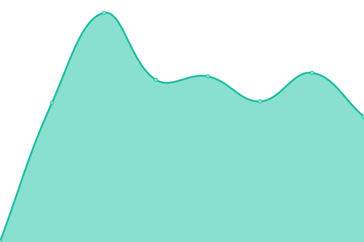
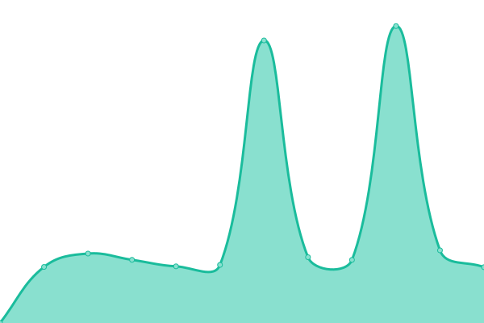

# [📈 Live Status](https://tmak2002.github.io/Upptime): <!--live status--> **🟩 All systems operational**

This repository contains the open-source uptime monitor and status page for [Torben Kahnert](https://tmak2002.dev), powered by [Upptime](https://github.com/upptime/upptime).

With [Upptime](https://upptime.js.org), you can get your own unlimited and free uptime monitor and status page, powered entirely by a GitHub repository. We use [Issues](https://github.com/tmak2002/Upptime/issues) as incident reports, [Actions](https://github.com/tmak2002/Upptime/actions) as uptime monitors, and [Pages](https://tmak2002.github.io/Upptime) for the status page.

<!--start: status pages-->
<!-- This summary is generated by Upptime (https://github.com/upptime/upptime) -->
<!-- Do not edit this manually, your changes will be overwritten -->
<!-- prettier-ignore -->
| URL | Status | History | Response Time | Uptime |
| --- | ------ | ------- | ------------- | ------ |
|  [tmak2002.dev](https://tmak2002.dev) | 🟩 Up | [tmak2002-dev.yml](https://github.com/tmak2002/Upptime/commits/HEAD/history/tmak2002-dev.yml) | 

 562ms
     
 | 

<a href="https://tmak2002.github.io/Upptime/history/tmak2002-dev">100.00%</a>
    

|  [catsarebeautiful.de](https://catsarebeautiful.de) | 🟩 Up | [catsarebeautiful-de.yml](https://github.com/tmak2002/Upptime/commits/HEAD/history/catsarebeautiful-de.yml) | 

 485ms
     
 | 

<a href="https://tmak2002.github.io/Upptime/history/catsarebeautiful-de">100.00%</a>
    

|  [SearXNG](https://search.catsarebeautiful.de) | 🟩 Up | [sear-xng.yml](https://github.com/tmak2002/Upptime/commits/HEAD/history/sear-xng.yml) | 

 499ms
     
 | 

<a href="https://tmak2002.github.io/Upptime/history/sear-xng">100.00%</a>
    

|  [Redlib](https://redlib.catsarebeautiful.de) | 🟩 Up | [redlib.yml](https://github.com/tmak2002/Upptime/commits/HEAD/history/redlib.yml) | 

 2238ms
     
 | 

<a href="https://tmak2002.github.io/Upptime/history/redlib">100.00%</a>
    

|  [AnonymousOverflow](https://overflow.catsarebeautiful.de) | 🟩 Up | [anonymous-overflow.yml](https://github.com/tmak2002/Upptime/commits/HEAD/history/anonymous-overflow.yml) | 

 443ms
     
 | 

<a href="https://tmak2002.github.io/Upptime/history/anonymous-overflow">100.00%</a>
    

|  [Mozhi](https://mozhi.catsarebeautiful.de) | 🟩 Up | [mozhi.yml](https://github.com/tmak2002/Upptime/commits/HEAD/history/mozhi.yml) | 

 683ms
     
 | 

<a href="https://tmak2002.github.io/Upptime/history/mozhi">100.00%</a>
    

<!--end: status pages-->

[**Visit our status website →**](https://tmak2002.github.io/Upptime)

## 📄 License

- Powered by: [Upptime](https://github.com/upptime/upptime)
- Code: [MIT](./LICENSE) © [Anand Chowdhary](https://anandchowdhary.com), supported by [Pabio](https://pabio.com)
- Data in the `./history` directory: [Open Database License](https://opendatacommons.org/licenses/odbl/1-0/)
